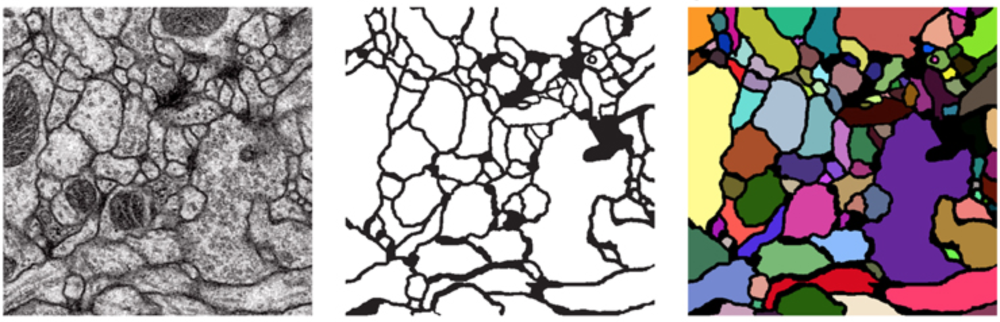

# Neuron Segmentation using U-Net

## 🧠 What is This Project?
This project implements a **U-Net** model for **biomedical image segmentation**, designed to label **neurons** in electron microscopy images.  
U-Net is a convolutional neural network (CNN) architecture that excels at pixel-level predictions, especially for segmentation tasks in medical imaging where spatial precision is critical.

---

## ❓ Why This Model?
Traditional CNNs lose spatial information during downsampling, which limits their usefulness for precise segmentation.  
U-Net overcomes this by introducing **skip connections** between the encoder (contracting path) and decoder (expanding path), allowing the network to:
- Capture both **context** (what is in the image) and **localization** (where it is),
- Efficiently learn from a **limited number of annotated biomedical images**,  
- Achieve **state-of-the-art segmentation accuracy** with relatively small datasets.

The dataset used comes from electron microscopy of neural tissue:  
> Arganda-Carreras et al. (2015). "Crowdsourcing the creation of image segmentation algorithms for connectomics." *Frontiers in Neuroanatomy.*  
> [Link](https://www.frontiersin.org/articles/10.3389/fnana.2015.00142/full)

---

## ⚙️ How It Works

### 1. **Dataset**
The dataset consists of grayscale electron microscopy images and their corresponding segmentation masks. Each pixel is labeled as part of a neuron or background.

### 2. **Model Architecture**
The model follows the **U-Net** design, comprising:
- **Contracting Path (Encoder):**  
  Multiple convolutional and max pooling layers that extract increasingly abstract image features while reducing spatial resolution.
- **Expanding Path (Decoder):**  
  Upsampling and convolutional layers that reconstruct the segmentation mask, using skip connections to retain spatial detail from the encoder.
- **Final Output Layer:**  
  A convolution layer that maps the feature maps to a binary segmentation mask.

### 3. **Training**
- **Loss Function:** Binary cross-entropy, optimized for per-pixel classification.
- **Optimizer:** Adam optimizer for efficient gradient-based learning.
- **Evaluation:** Dice coefficient and visual inspection of predicted masks.
- **Framework:** Implemented using **PyTorch** for flexibility and GPU acceleration.

---

## 🧩 Summary
This notebook demonstrates how deep learning, specifically **U-Net**, can effectively perform **neural tissue segmentation** — a foundational step toward automated **connectomics** and **neuroscience analysis**.  
It provides a practical implementation of supervised biomedical segmentation using a concise, interpretable architecture that has become a standard in the field.
